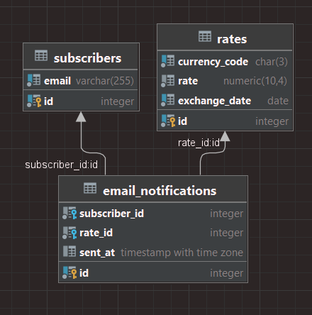

# Exchange Monitor

## Setup
Setup project with docker-compose

```bash
docker-compose up -d
```

## Test

```bash
go test ./... -v
```

## API 

```bash
docker-compose -f docker-compose-local.yaml up -d
```

## Database

