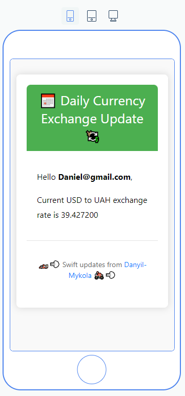
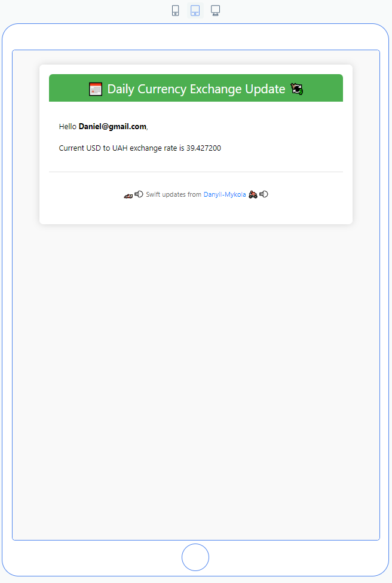
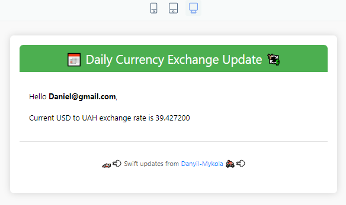

# Exchange Monitor

## Introduction
Exchange Monitor is a robust web application designed to monitor the exchange rate of USD to UAH by using the NBU API and to alert subscribers daily about the exchange rate on their email. 
The application is built using Go, PostgreSQL, and Docker. Mailtrap is used to send emails to subscribers.

## Features
- Monitor exchange rate of USD to UAH using NBU API
- Alert subscribers daily about the exchange rate on their email (new subscribers will also be notified each day, if the application is running)

__Bonuses:__
- Well __structured__ code
- __Dockerized__ application
- __Configurable__ via config file
- __Graceful shutdown__ of the application
- __Makefile__ for easy operations
- __Unit tests__ of important functions
- __Linting and formatting__ of the code
- Beautiful and responsive __email template__ 

## Requirements
- Docker
- Go (if running without Docker)

## Installation
Begin by cloning the repository to your local machine:

```bash
git clone https://github.com/danyaobertan/exchangemonitor.git
```

```bash
cd exchangemonitor
```

__IMPORTANT:__ Please update local.yaml with real smtp `name` and `password` if you want to test email sending functionality.


## Makefile
Take advantage of the Makefile to streamline operations:

```bash
make help
```

```bash
Usage:
  make install              - Install all dependencies.
  make run                  - Run the application.
  make build                - Build the executable binary.
  make test                 - Run tests.
  make lint                 - Run linter.
  make clean                - Clean the binary.
  make docker-build         - Build the Docker image.
  make docker-run           - Run the Docker container.
  make docker-stop          - Stop and remove the Docker container.
  make docker-clean         - Remove Docker image.
  make docker-compose-up    - Run Docker Compose.
  make docker-compose-down  - Stop Docker Compose.
  make docker-compose-clean - Remove Docker Compose.
  make help                 - Show this help message.
```

## Setup
Setup project with docker-compose

```bash
docker-compose up -d
```

Setup only database with docker-compose

```bash
docker-compose -f docker-compose-db-only.yaml up -d
```

## APIs could be conveniently tested using requests.http file
- Open the requests.http file in the root directory

## Test
```bash
go test ./... -v
```

## Database
- Actually, only one table is used by the application. The table is called `subscribers` it contains subscribers email addresses.
- As the future development, the table `rates` could be used to store the historical data of the exchange rate.
- Also `email_notifications` table could be used to store the information about all the notification events.


## HTML Email Template
### Phone view

### Tablet view

### Desktop view
